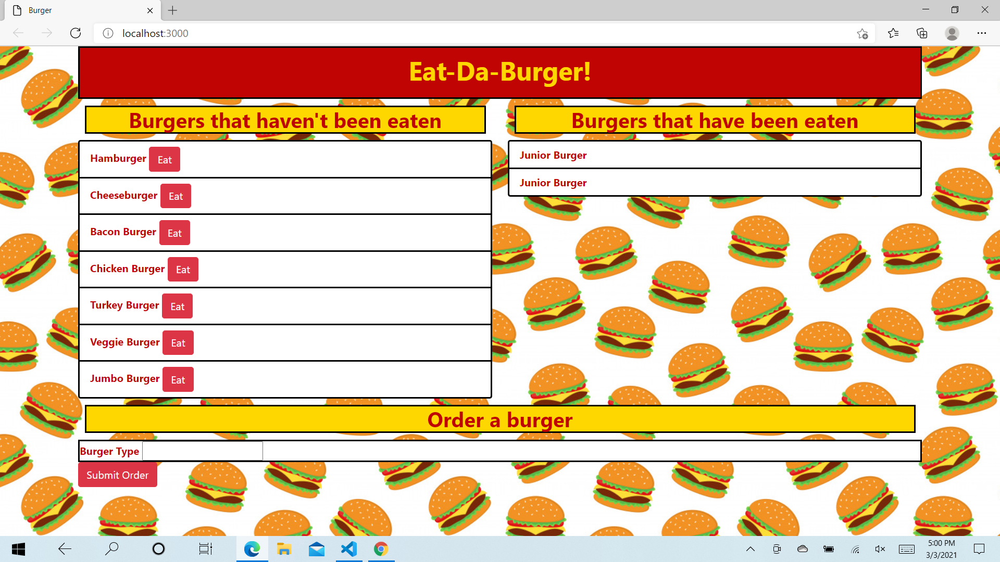

# Burger
An app where can type in a burger order, and/or click on the "Eat" button to indicate which burger(s) on the list you have eaten.When you have "eaten" or "devoured" a burger, that burger will move to list on the right, which is called "Burgers that have been eaten".
Requires mysql and dotenv
Uses javascript, mysql, handlebars and css

https://buger-bn.herokuapp.com/
https://github.com/bnicholson87/Burger.git